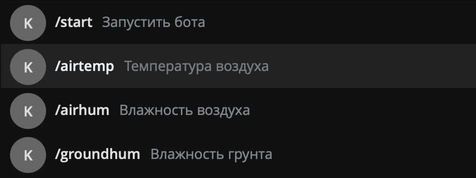
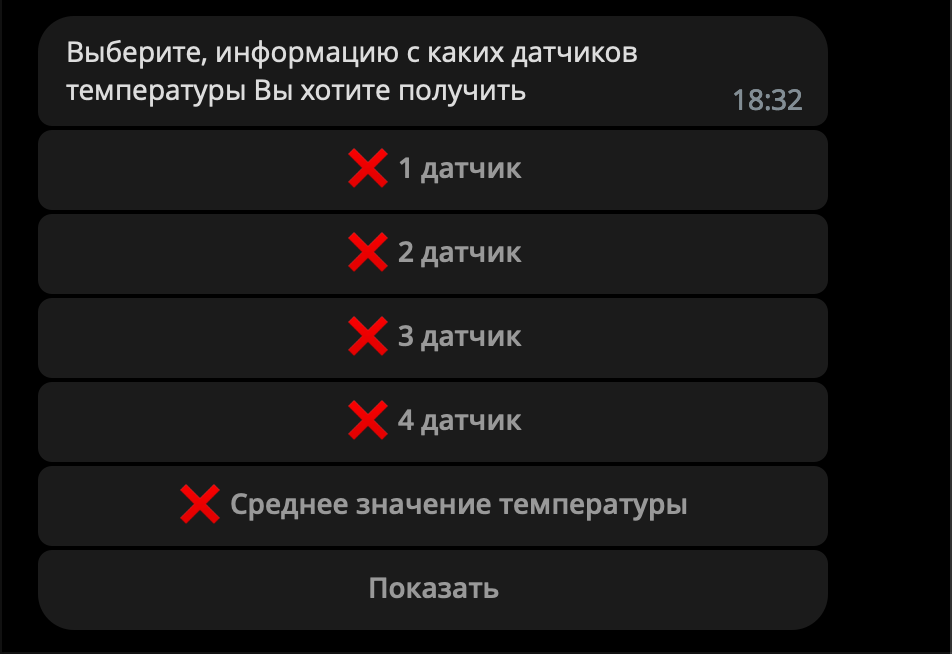
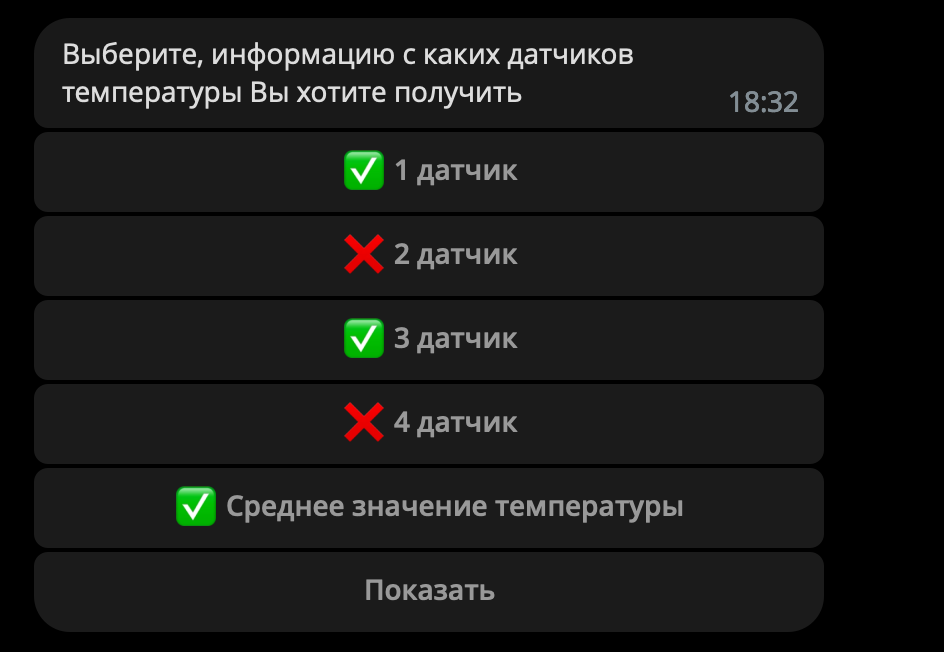
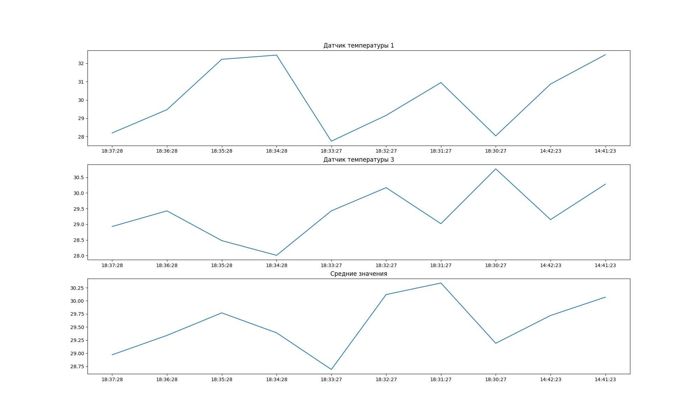

# Примеры работы бота

## Содержание
1. [Получение показаний температуры воздуха](#получение-показаний-температуры-воздуха)
2. [Получение показаний влажности воздуха](#получение-показаний-влажности-воздуха)
3. [Получение показаний влажности почвы](#получение-показаний-влажности-почвы)
4. [Управление системой увлажнения](#управление-системой-увлажнения)
5. [Управление положением окон](#управление-положением-окон)
6. [Управление системой полива грядок](#управление-системой-полива-грядок)
7. [Принудительное управление системами](#принудительное-управление-системами)
8. [Добавление показаний датчиков вручную](#добавление-показаний-датчиков-вручную)
9. [Изменение значений пределов интервалов нормальных показаний датчиков и периода обращения к API теплицы](#изменение-пределов-интервалов-нормальных-показаний-датчиков-и-периода-обращения-к-api-теплицы)

### Получение показаний температуры воздуха

Выбираем нужную команду в Меню


Получаем следующее сообщение


Выбираем нужные нам данные. Например, выберем 1 и 3 датчики и средние значения показаний:


И нажимаем кнопку ```Показать```. В результате получаем следующее сообщение и картинку:

```
Показания с 1 датчика температуры
2023-02-15 18:37:28 : 32.47
2023-02-15 18:36:28 : 30.87
2023-02-15 18:35:28 : 28.04
2023-02-15 18:34:28 : 30.95
2023-02-15 18:33:27 : 29.16
2023-02-15 18:32:27 : 27.75
2023-02-15 18:31:27 : 32.45
2023-02-15 18:30:27 : 32.22
2023-02-15 14:42:23 : 29.47
2023-02-15 14:41:23 : 28.2


Показания с 3 датчика температуры
2023-02-15 18:37:28 : 30.28
2023-02-15 18:36:28 : 29.15
2023-02-15 18:35:28 : 30.77
2023-02-15 18:34:28 : 29.02
2023-02-15 18:33:27 : 30.17
2023-02-15 18:32:27 : 29.43
2023-02-15 18:31:27 : 28.01
2023-02-15 18:30:27 : 28.48
2023-02-15 14:42:23 : 29.43
2023-02-15 14:41:23 : 28.93


Средние значения температуры воздуха
2023-02-15 18:37:28 : 30.07
2023-02-15 18:36:28 : 29.72
2023-02-15 18:35:28 : 29.19
2023-02-15 18:34:28 : 30.34
2023-02-15 18:33:27 : 30.12
2023-02-15 18:32:27 : 28.69
2023-02-15 18:31:27 : 29.39
2023-02-15 18:30:27 : 29.77
2023-02-15 14:42:23 : 29.34
2023-02-15 14:41:23 : 28.97
```


### Получение показаний влажности воздуха

### Получение показаний влажности почвы

### Управление системой увлажнения

### Управление положением окон

### Управление системой полива грядок

### Принудительное управление системами

### Добавление показаний датчиков вручную

### Изменение значений пределов интервалов нормальных показаний датчиков и периода обращения к API теплицы
